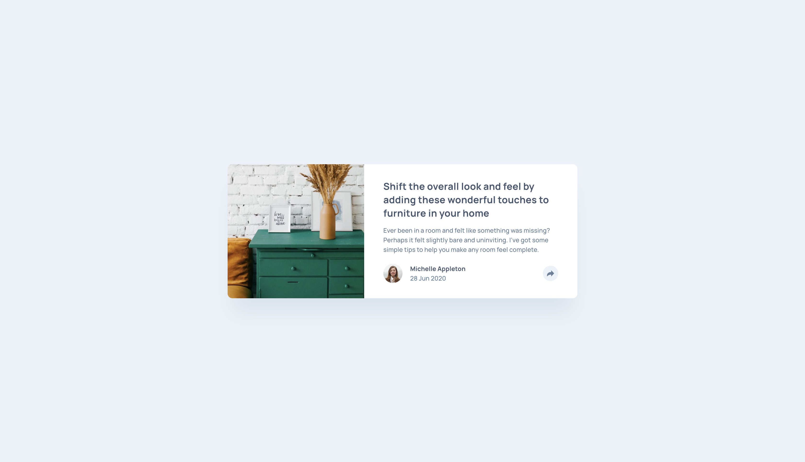
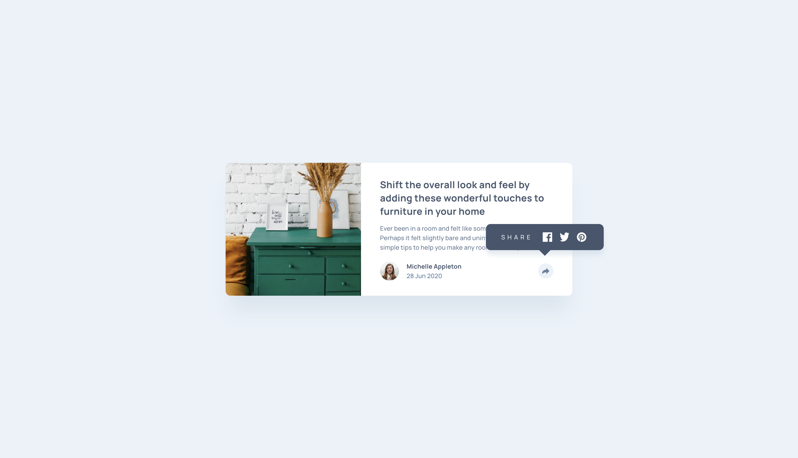
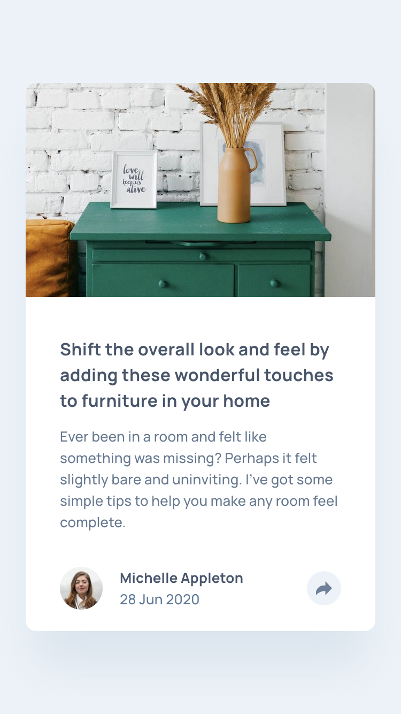
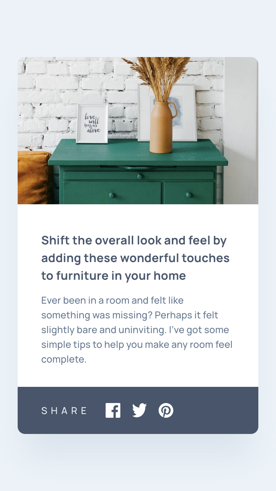

# Frontend Mentor - Article preview component solution

This is a solution to the [Article preview component challenge on Frontend Mentor](https://www.frontendmentor.io/challenges/article-preview-component-dYBN_pYFT). Frontend Mentor challenges help you improve your coding skills by building realistic projects.

## Table of contents

- [The challenge](#the-challenge)
- [Screenshots](#screenshots)
  - [1. Desktop version](#1-desktop-version)
  - [2. Mobile version](#2-mobile-version)
- [PageSpeed Insights results](#pagespeed-insights-results)
- [Links](#links)
- [My process](#my-process)
  - [Built with](#built-with)
  - [Tested with](#tested-with)
  - [What I learned](#what-i-learned)
  - [Useful resources](#useful-resources)
- [Acknowledgement](#acknowledgement)
- [Author](#author)

## Overview

### The challenge

Users should be able to:

- View the optimal layout for the component depending on their device's screen size
- See the social media share links when they click the share icon

### Screenshots

##### 1. Desktop version




##### 2. Mobile version




### PageSpeed Insights results

[Mobile version](https://pagespeed.web.dev/analysis/https-rupali317-github-io-article-preview-component/1jiwxfks5h?form_factor=mobile)

[Desktop version](https://pagespeed.web.dev/analysis/https-rupali317-github-io-article-preview-component/1jiwxfks5h?form_factor=desktop)

### Links

- Solution URL: [Article preview component github](https://github.com/rupali317/article-preview-component)
- Live Site URL: [Article preview component live](https://rupali317.github.io/article-preview-component/)

## My process

### Built with

- Semantic HTML5 markup
- CSS custom properties
- Flexbox
- CSS grid
- Mobile-first workflow
- Javascript
- [Github Pages](https://pages.github.com/) - Allows to host static websites directly from a GitHub repository.

### Tested with

- Browsers used for testing: Google Chrome, Firefox, Safari, Brave, Microsoft Edge.
- Devices:
  - (Real) MacBook Pro (15-inch), Samsung Galaxy A33 5G, Samsung Galaxy S20+, iPad Air 2, MacBook Pro (13-inch).
  - (Virtual) The mobile and tablet devices mentioned under Chrome's dev console.
- Screen reader: MacOS VoiceOver.

### What I learned

1. Able to craft an arrow using css tricks. Border width help determine the dimension of the arrow. 0 dimension is crucial in achieving the look along with making the adjacent borders as transparent. Removing the adjacent borders instead of making it transparent will not function as everything will be invisible especially when the dimension is set as 0.

```css
.tooltip-wrapper::after {
  content: "";
  position: absolute;
  left: 50%;
  transform: translateX(-50%);
  width: 0;
  height: 0;
  border-left: var(--space-s-1) solid transparent;
  border-right: var(--space-s-1) solid transparent;
  border-top: var(--space-s-1) solid var(--color-neutral-5);
}
```

2. Both aria-expanded and aria-describedby are needed for screen relader to read the content of the tooltip. A) Only aria-expanded=”false/true” without aria-describedby → It will only read the status if the button is expanded or not but will not read the content of the tooltip. B) Only aria-describedby” without aria-expanded → It will not read out if it is expanded or not. It wont read out the content of the tooltip.

```html
<button
  id="share-btn-js"
  aria-label="Share article"
  aria-description="You can share this article via Facebook, Twitter and Pinterest"
  aria-haspopup="true"
  aria-expanded="false"
>
  
</button>
<div class="tooltip-wrapper invisible" id="tooltip-wrapper-js">
  <span id="tooltip" role="tooltip"> ... </span>
</div>
```

```js
function toggleShareButtonAttributes() {
  if (tooltip.classList.contains("invisible")) {
    shareButton.removeAttribute("aria-describedby");
    shareButton.setAttribute("aria-expanded", "false");
  } else {
    shareButton.setAttribute("aria-describedby", "tooltip");
    shareButton.setAttribute("aria-expanded", "true");
  }
}
```

### Useful resources

- [JS Basics](https://students.magicaldevschool.com/learn-javascript/js-basics/) - The articles in this resource are ideal for revisiting JS basics. The article also provide hands-on exercise that are key in reinforcing the learnings.
- [The Document Object Model](https://www.frontendmentor.io/learning-paths/javascript-fundamentals-oR7g6-mTZ-/steps/660f4d7b2f40450f917f3ca0/article/read) - Provides best practices for accessing elements from the Document Object Model.

## Acknowledgement

I express my gratitude towards my mentor - Deborah for the insightful code review session and for suggesting improvements.

## Author

- Website - [Rupali Roy Choudhury](https://www.linkedin.com/in/rupali-rc/)
- Frontend Mentor - [@rupali317](https://www.frontendmentor.io/profile/rupali317)
